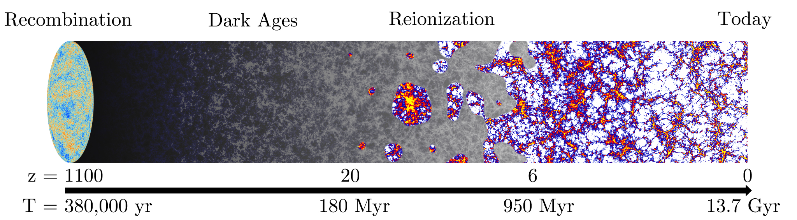
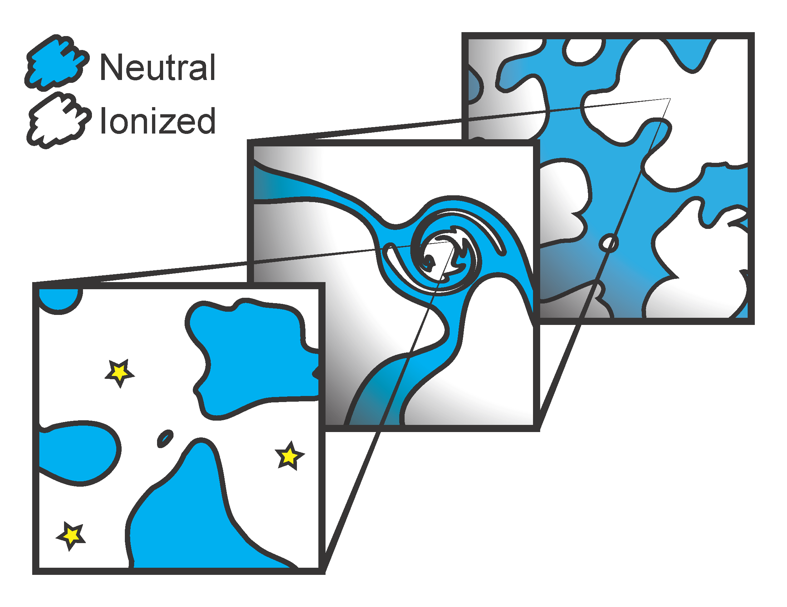

# Reionization 

My current research is focused on the epoch of reionization. 
It is an epoch in the history of the evolution of our universe when it gradually became `transparent'.

Here are a few pictures without a context:

Zoom in of a simulation:
https://gfycat.com/SentimentalSillyAmurstarfish

Excursion set formalist applied for reionizaiton visualization:
https://www.youtube.com/watch?v=tL-Y28yMxWU

HD images of a simulation snapshot:
http://imgur.com/t23rV20
http://imgur.com/3T0JQGQ

